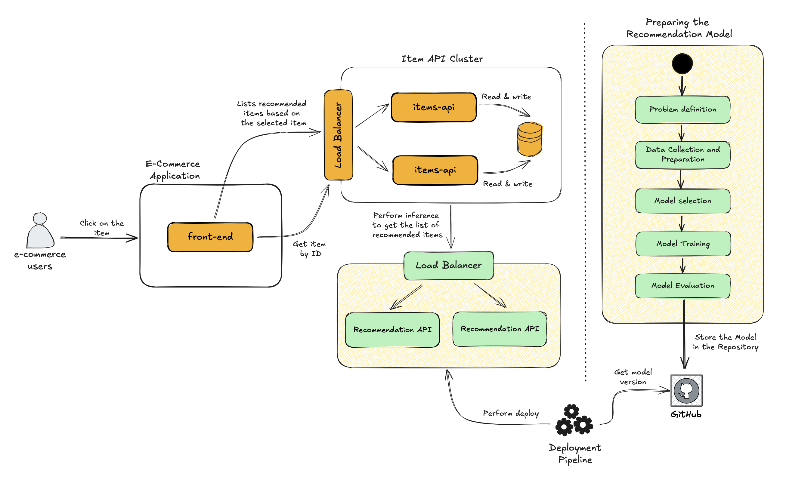
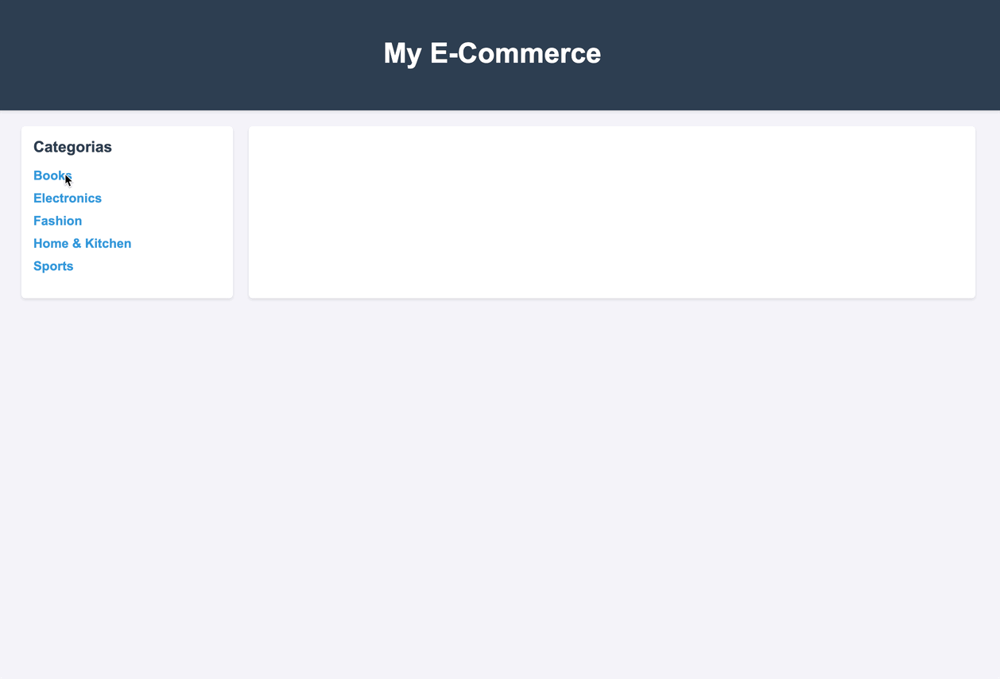

# Sistema de Recomendação de Produtos

Este repositório contém a implementação de um sistema de recomendação de produtos utilizando Machine Learning. O projeto foi desenvolvido para demonstrar como integrar sistemas transacionais com modelos de machine learning que realizam inferências em tempo real, oferecendo soluções práticas e eficientes para recomendação de produtos em e-commerce.

O sistema combina uma estrutura modular que separa as responsabilidades de frontend, backend e machine learning, que permite explorar a interação entre diferentes componentes. Ele também exemplifica como conectar APIs ao modelo treinado.

Com este repositório, espera-se fornecer um exemplo claro e funcional de como aplicar técnicas de machine learning para melhorar a experiência do usuário e aumentar a eficiência de negócios baseados em dados.

## Arquitetura


### Componentes da Arquitetura
| Componente                | Descrição                                                                                     |
|---------------------------|---------------------------------------------------------------------------------------------|
| **Front-End**             | Responsável por exibir os produtos, categorias e recomendações para os usuários.            |
| **Item API Cluster**      | API que gerencia os dados de produtos (leitura e escrita) no banco de dados.                |
| **Recommendation API**    | API que utiliza o modelo de machine learning para fornecer produtos recomendados.            |

### Executando 
A aplicação está configurada para ser executada com Docker Compose. Siga os seguintes passos:

1. Clone o repositório

```bash
git clone https://github.com/Waelson/recommendation.git
cd recommendation
```

2. Suba toda a stack
```bash
docker-compose up --build
```

3. Acessando a aplicação
 - Digite a URL http://localhost:8080 no seu browser
 - Navegue nas categorias e depois clique em um produto para visualizar as recomendações sendo feitas em tempo real pela aplicação Recommendation API. 

### Como a aplicação se parece


## Abordagem de Machine Learning Utilizada

> **⚠ AVISO:** O modelo demonstrado neste repositório é apenas para testes e fins didáticos. Ele **não deve ser utilizado em ambiente produtivo**, pois não atende aos requisitos de segurança, escalabilidade e desempenho necessários para aplicações reais.


Para o treinamento do modelo de recomendação, utilizamos a abordagem de **Filtragem Baseada em Conteúdo (Content-Based Filtering)**. Essa técnica analisa os atributos dos produtos, como descrições, categorias, preços e outras informações estruturadas, para identificar similaridades e oferecer recomendações.

### Como Funciona
1. **Representação dos Dados**: Os produtos são representados como vetores numéricos em um espaço multidimensional, utilizando técnicas como TF-IDF para processar texto e normalização para atributos numéricos.
2. **Cálculo de Similaridade**: A similaridade entre os produtos é calculada usando métricas como a Similaridade de Cosseno, permitindo identificar itens semelhantes ao produto selecionado.
3. **Inferência**: Com base no produto consultado, o modelo retorna os itens mais similares, ordenados por relevância.

### Vantagens da Abordagem
- **Independência do Comportamento do Usuário**: A recomendação é baseada nos atributos dos produtos, não dependendo de histórico de interações.
- **Escalabilidade**: Fácil de escalar para novos produtos, desde que as características estejam disponíveis.
- **Explicabilidade**: As recomendações podem ser facilmente explicadas com base nas similaridades entre os atributos.

